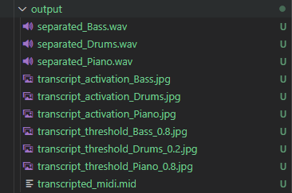

# CERBERUS Network for Music Separation & Transcription
---
This is a rough implementation of 
[Simultaneous Separation and Transcription of Mixtures with Multiple Polyphonic and Percussive Instruments](https://arxiv.org/abs/1910.12621) (Ethan Manilow et al., ICASSP2020)

## Note

This implementation did not achieve as much performance as reported in the paper.


## Demo (Source Separation)

[](https://youtu.be/59uTEk0ZamE)


## Quantitative Evaluation (Transcription)

|       | Precision | Recall | Accuracy |
| ----- | --------- | ------ | -------- |
| Piano | 0.585     | 0.566  | 0.460    |
| Bass  | 0.797     | 0.817  | 0.747    |
| Drums | 0.230     | 0.417  | 0.133    |

- Note : There's no benchmark dataset. These results are measured on data I randomly created using test set of Slakh2100 dataset. So It is not appropriate to quantitatively compare these results with those reported in the paper.

## Pretrained Network & config

- [Weight(ckpt)](https://github.com/sweetcocoa/cerberus-pytorch/raw/weights/weights/last.ckpt)
- [Config(yaml)](https://github.com/sweetcocoa/cerberus-pytorch/raw/weights/weights/hparams.yaml)


## Inference

```bash
python inference.py hparams.yaml weight.ckpt input.wav output_dir/
```

- Expected Results:

    


## Training with Slakh2100 Dataset

1. Get Slakh2100 dataset (See: [Slakh2100 Project](http://www.slakh.com/))
2. Downsample audio to 16k
3. Modify configs/config.yaml
    ```yaml
    data_dir: "/path/to/slakh2100_flac_16k/"

    # see: validation_epoch_end() in network/cerberus_wrapper.py
    sample_audio:
    path: "/path/to/sample/audio/sample_rate_16k.wav"
    offset: 1264000 
    num_frames: 160000
    ```
4. Run training
    ```bash
    python train.py
    ```


## Contact
- Jongho Choi (sweetcocoa@snu.ac.kr)
- Jiwon Kim
- Ahyeon Choi
